# Utilisation de git pour le projet Netflix-clone

- [Création et partage du repository](#Création-et-partage-du-repository)
  - [Hébergement sur github](#Hébergement-sur-github)
  - [Contributeurs](#Contributeurs)
  - [Clef SSH pour authentification lors des échanges avec le repo](#Clef-SSH-pour-authentification-lors-des-échanges-avec-le-repo)
  - [Initialisation du dépôt local et récupération du repo distant](#Initialisation-du-dépôt-local-et-récupération-du-repo-distant)
- [Workflow](#workflow)
  - [Présentation + schéma](#Présentation-+-schéma)
  - [Utilisation du tableau de projet git](#Utilisation-du-tableau-de-projet-git)
  - [Création et suppression des branches](#Création-et-suppression-des-branches)
- [Création et développement d'une feature](#Création-et-développement-d'une-feature)
  - [Création de la branche depuis develop](#Création-de-la-branche-depuis-develop)
    - [Mise à jour de develop](#Mise-à-jour-de-develop)
    - [Création de la branche ](#Création-de-la-branche)
  - [Envoie du travail dans repo github](#Envoie-du-travail-dans-repo-GitHub)
    - [Vérifier les fichiers qui on eu un changement par rapport au dernier commit](#Vérifier-les-fichiers-qui-ont-eu-un-changement-par-rapport-au-dernier-commit)
    - [Ajouter les fichiers que l'on veut envoyer a notre dépôt distant](#Ajouter-les-fichiers-que-l'on-veut-envoyer-à-notre-dépôt-distant)
    - [Commit](#Commit)
    - [Modifier le message d'un commit](#Modifier-le-message-d\'un-commit)
  - [Sauvegarde du travail sans commit : git stash](#Sauvegarde-du-travail-sans-commit)
- [Mise à jour de la branche develop](#Mise-à-jour-de-la-branche-develop)
  - [Merge de la branche develop](#Merge-de-la-branche-develop)
  - [Résolution de potentiels conflits](#Résolution-de-potentiels-conflits )
- [Mise à jour de la branche release](#Mise-à-jour-de-la-branche-release)
- [Mise à jour de la branche main](#Mise-à-jour-de-la-branche-main)
  - [Création d'un tag de version](#Création-d'un-tag-de-version)


​	Pour réaliser notre projet nous avons utilisé l'outil de versionning GIT qui est un outil de gestion de version (SCM) qui permet de garder une trace de chaque modification et qui facilite grandement le travail collaboratif. C'est décentralisé ce qui permet d'avoir toujours une version assez récente sauvegardée sur un pc en local, mais également de travailler sans avoir besoin d'être connecté à internet. 

​	Afin de partager et stocker notre projet nous utilisons le service web hébergement GitHub.

## Création et partage du repository

### Hébergement sur github

Pour héberger sur GitHub il faut créer un dépôt : 

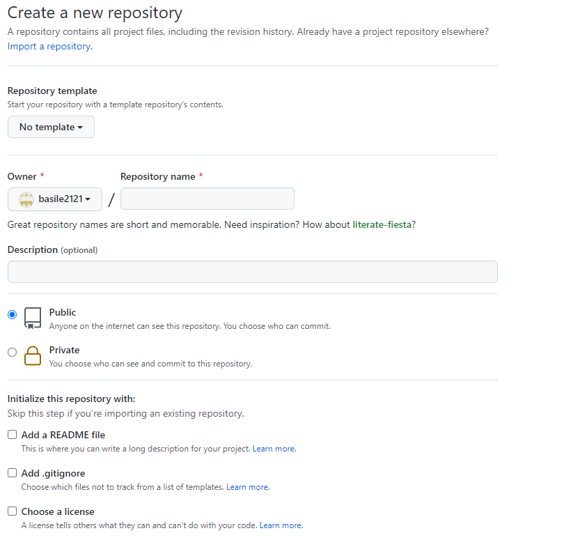

**On peut y renseigner les informations suivantes :** 

- Propriétaire du repo / Nom du repo
- Une description du projet 
- Choisir de partager en public ou non le repository
- Ajouter des fichiers supplémentaires au repo : 
  - Un README qui sera au format markdown et qui nous permettra d'écrire notre documentation qui sera visible sur notre repo GitHub
  - Un fichier .gitignore qui contiendra tous les fichiers locaux que l'on ne voudra pas envoyer sur notre repo. Par exemple des fichiers de configuration d'environnement, ou des dossiers de dépendances qui ne sont pas utiles et très lourds.
  - Une license pour règlementer l'utilisation du code source 

### Contributeurs

Vous pouvez inviter les utilisateurs à devenir des collaborateurs de votre dépôt GitHub

Pour faire ça il suffit de se rendre sur setting/collaborateurs : Ajouter un collaborateur. 

Cela permettra a ces personnes de venir développer sur le repo et de le voir.

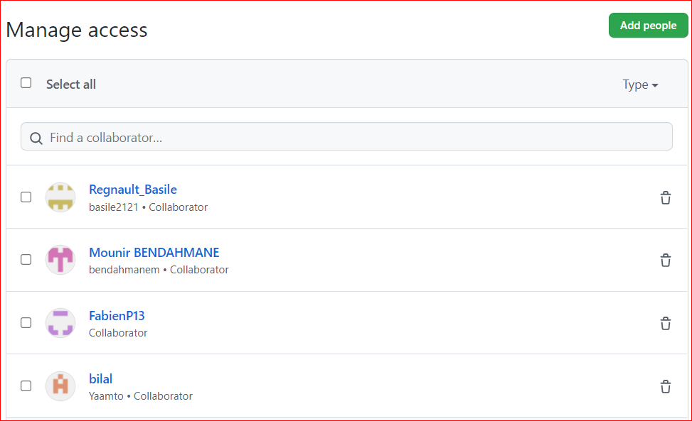

### Clef SSH pour authentification lors des échanges avec le repo

**Il y a deux facons de communiquer avec un repo GitHub :** 

- Via HTTPS mais c'est déprécié sauf via un token que l'on peut créer dans Profil/Settings/Developer settings/Personal access tokens
- Via SSH durée de vie limitée, spécifique à une machine. Donc très sécurisé, c'est ce qu'on va utiliser.

Clé SSH c’est parmi les manières les plus sécurisés pour communiquer avec le repo distant GitHub.

**Pour la mettre en place :**


Il faudra génèrer une clef SSH en local sur son pc via la commande : 

```
ssh-keygen -t rsa
```

Cette commande nous demandera un mot de passe qui sera ensuite utilisé pour communiquer avec notre repo distant.

On ira ensuite copier notre clef public pour la renseigner dans l’onglet SSH and GPG keys, puis cliquer sur le bouton “new SSH key”.

Il faut alors simplement coller le contenu du fichier id_rsa.pub que l’on a copié depuis notre PC, puis valider.

### Initialisation du dépôt local et récupération du repo distant

**Pour initialiser le repo local  sur notre pc il faut suivre ces étapes :** 

- Entrez la commande `git init` pour initialiser un repository Git vide. Cela aura pour conséquence de créer un dossier caché .git . On peut alors lier notre dépôt local au dépôt GitHub 

- ```
  git remote add origin git@github.com:mhwalid/netflix-clone.git //Fais la connexion avec le repo
  ```

**Ou alors faire la commande :** 

```
git clone git@github.com:mhwalid/netflix-clone.git
```

Elle va venir faire le git init ainsi que le git remote add avec le dépôt distant.

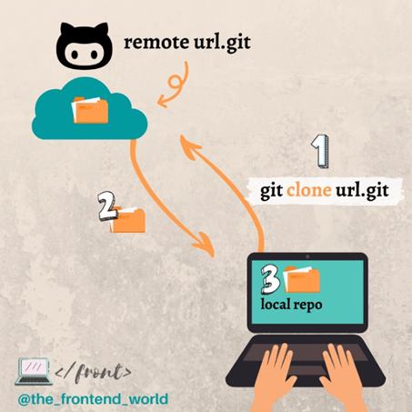

## Workflow 

### Présentation + schéma

**Nous avons utilisé le `workflow` de git permettant d’instaurer une méthode de travail et un déploiement optimisé :**

​	Une branche git est une divergence du projet principal qui va permettre de travailler sans avoir un impact sur celui-ci.

​	La branche `main` sera celle de production, nous mergeons dessus que lorsque tous les tests sont faits et que tout est fonctionnel. Il ne doit pas avoir de bug et elle doit être utilisée seulement par le client final.

​	Nous utiliserons une branche de recette qui se nomme « `release` », il s’agit d’une branche pour la phase de test pour faire la passerelle entre les branches `develop` et `main`. La phase de test est la dernière étape avant la mise en production d'un projet. C'est durant cette étape que l'on va tester les fonctionnalités de notre projet, faire les démonstrations auprès du client avant sa mise en service. Régulièrement, après un ajout important de fonctionnalités sur notre branche develop, nous les testons sur la branche release. Ce cycle peut se répéter 'x' fois avant la mise en service du projet.

​	Nous aurons ensuite une branche `develop` qui servira de point central au développement de nos nouvelles fonctionnalités.

​	Nous assignons aux autres branches une fonctionnalité, elle seront toutes créée à partir de la branche `develop`. Les développeurs coderont exclusivement sur ces branches. Lorsqu'une fonctionnalité sera finie, le ou les développeur(s) viendront merge la branche créée sur develop.

### Utilisation du tableau de projet git

Durant ce projet nous utilisons un outil de gestion de projet qui est natif à Github. Il se trouve dans l’onglet « `projet` » de notre repository. 

Le but de cet outil est d’établir un planning des tâches à réaliser et de visualiser leur progression grâce à différents états d'avancement. Mais également d'avoir le suivi des fonctionnalités développées et des personnes qui les ont développées.

**Pour le projet  GIT, nous avons créé 4 sections états des taches :** 

- « `To do` », il s’agit du backlog, des tâches à faire qui ne sont pas encore assignées.
- « `In progress` », une section des tâches en cours, les tâches sont assignées et une issue créée.
- « `Test` », toutes les tâches doivent être/sont testées.
- « `Done` », les tâches sont finies, les issues sont fermées.

​	De plus, nous pouvons utiliser l’outil « `issues` » de GitHub, permettant le suivi des tâches du projet, de les assigner individuellement à un ou plusieurs membre(s) du projet et de définir un label pour chaque issue pour identifier plus rapidement le type de fonctionnalité développées : 

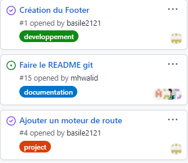

A chaque nouvelle `feature`, on crée une issue. Lorsque la pull request fusionne, l'issue se ferme.

### Création et suppression des branches

**Pour créer une `branche` nous pouvons utiliser la commande :** 

```
git branch <NomDeLaBranche>
```

Cela créer un pointeur sur un commit HEAD.

HEAD fait référence au dernier commit de la branche actuelle.

Vous pouvez savoir quel HEAD vous visualisez en ouvrant le fichier `.git/HEAD` dans votre dépôt :

**Une fois la branche créée, pour se positionner dessus nous utilisons :**

```
git checkout <NomDeLaBranche>
```

Met à jour les fichiers dans l’arbre de travail pour correspondre à la version dans l’index ou dans l’arbre spécifié.

 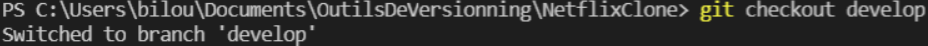

**Il existe également une commande permettant de créer une branche et de se positionner directement dessus :**

```
git checkout -b <NomDeLaBranche>
```

 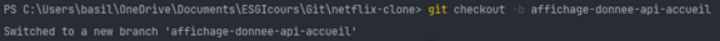

**Une fois cela, nous pouvons lister toutes les branches locales :**

```
git branch
```

 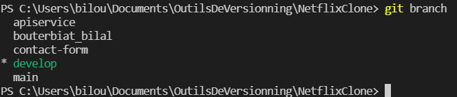

De plus, nous avons l'information sur la branche où nous nous trouvons.

**Pour lister les branches locales et distantes :**

```
git branch -av
```

 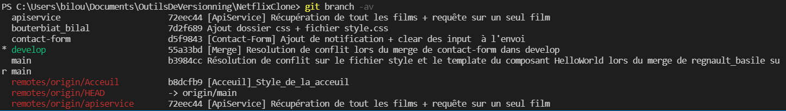

Les branches distantes sont en rouge.

**Si nous voulons supprimer une branche localement, nous devons utiliser :**

```
git branch -d <NomDeLaBranche>
```

 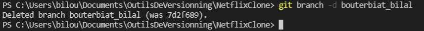

**Sur le repository distant :** 

```
git push origin --delete <NomDeLaBranche>
```

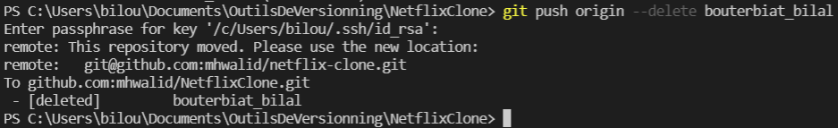


## Création et développement d'une feature 

​	Nous allons voir comment crée une fonctionnalités en respectant ce que nous avons définis dans notre `WorkFlow`.

### Création de la branche depuis develop

#### Mise à jour de develop

​	Dans un premier temps nous devons partir de notre branche `develop` qui est notre pivot entre le développement de nos fonctionnalités et la mise en production de notre projet. Avant toute opération il est important d'effecteur un : 

```shell
git pull origin develop
```

Cette commande nous permet de mettre à jour notre branche en local en fonction de la branche qui est sur le repo distant. Elle exécute dans l'ordre les 2 commandes : 

- `git fetch` qui va venir récupérer le contenu du dépôt distant 
- `git merge` qui prendra deux pointeurs de commit, le dernier de la branche sur laquelle nous sommes positionnés et le dernier commit commun aux deux branches en question

A noter que le terme `origin` est un alias qui cible le repository distant. 

**Comme on peut le voir sur cette capture d'écran :**

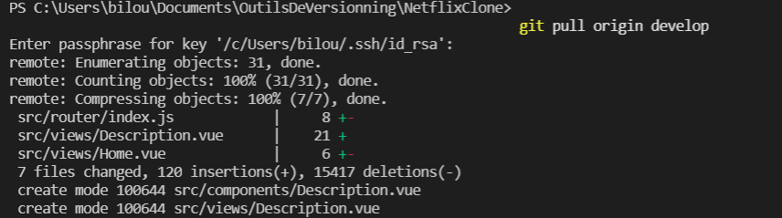

**On y vois plusieurs informations:** 

- La préparation de notre repo local `remote :` 
- On y vois la liste des fichiers existant qui sont impacter localement, avec le nombre de ligne qui ont subit un changement. Un + vert pour montrer un ajout, un - rouge pour montrer une suppression
- On a ensuite un résumer des changements fais avec le nombre de fichier changer, le nombre d'insertion total et le nombre de suppression total
- Enfin une liste de fichier nouveaux avec leurs chemin dans le repo

#### Création de la branche 

​	On crée notre branche et on se positionne dessus via la commande : 

```
git checkout -b mafeature
```

### Envoie du travail dans repo GitHub

​	Lorsque l'on développe sur notre branche et que l'on veut mettre à jour le dépôt distant on dois effectuer plusieurs opérations : 

#### Vérifier les fichiers qui ont eu un changement par rapport au dernier commit

Grace à la commande : 

```
git status
```

Cette commande permet d'afficher plusieurs informations : 

- Les fichiers qui ont des différences entre le fichier d'index et le commit HEAD actuel

- Les fichiers qui ont des différences entre l'arbre de travail et le fichier d'index

- Les chemins dans l'arbre de travail qui ne sont pas suivis par Git

**Exemple d'un git status :** 

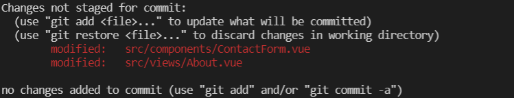

#### Ajouter les fichiers que l'on veut envoyer à notre dépôt distant

Grace à la commande : 

```
git add 
```

​	Elle permet de déplacer les fichiers qui sont dans le répertoire de travail local dans la zone appelée `staging` . Cette zone permet de regrouper les changements avant de les commiter dans l'historique du projet. Le but est de pouvoir faire des modifications ou revenir en arriére sur les fichiers avant de faire un commit.

#### Commit 

Grace à la commande : 

```
git commit -m "Message"
```

​	Cette commande réalise un commit en laissant un message de commit. 

​	Un commit va être une sauvegarde du projet à un instant t. 

​	Lorsque le commit est fait, la branche est mise à jour pour pointer vers ce dernier.

​	Un commit contient des informations sur l’auteur et le validateur du commit avec son adresse mail et son nom. On a également une date pour savoir quand il a était fait. Puis on a un message de validation du commit qui permet d'avoir des informations supplémentaires sur l'intérêt du commit et pour la traçabilité du projet. 

Si on ne spécifie pas l'option -m, un éditeur de texte apparait et on peut modifier le commit directement dans l'objet de commit : 

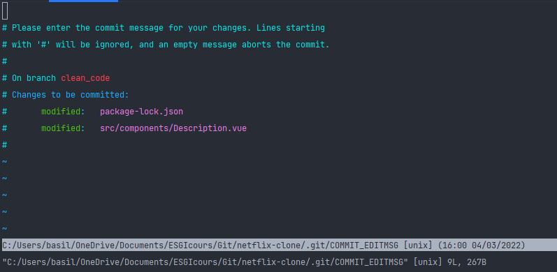

#### Modifier le message d'un commit 

Si nous ne sommes pas satisfaits de notre message de commit il est possible de le modifier avant l'envoi : 

```
git commit --amend -m "MessageModifier" // Pour modifier l'objet commit 
```

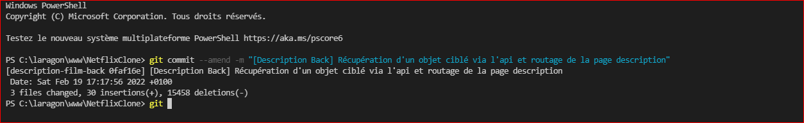

- **Mettre à jour notre dépôt distant**

Une fois toutes ces étapes réalisées on peut mettre à jour notre dépôt distant en fonction de notre dépôt local grâce à la commande : 

```
git push origin <nomBranche>
```

### Sauvegarde du travail sans commit

​	Lorsque l'on développe il peut arriver qu'une autre mission plus urgente nous soit attribuée comme la correction d'un bug sur une autre branche. Si on a des changements dans les fichiers, il n'est pas possible de changer de branche, git nous avertira avec ce message : 

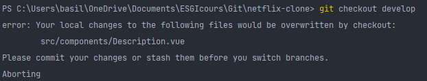

​	Pour éviter que notre travail soit effacé et que l'on ne veut pas réaliser un commit, il est possible de faire la commande : 

```
git stash
```

​	Cette commande va sauvegarder notre travail fait en local et venir rétablir le répertoire de travail par rapport a HEAD.

On peut voir la liste des stash via la commande : 

```
git stash list 
```

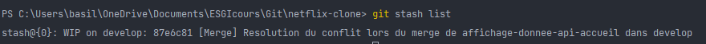

Une fois que l'on veut reprendre notre travail on peut faire 2 commandes : 

```
git stash apply // Récupere les fichiers, mais en les laissant dans le git stash on peut le nettoyer après avec git stash drop
git stash pop // Sort les fichiers du git stash
```

## Mise à jour de la branche develop

### Merge de la branche develop

**Dans un premier temps nous devons nous positionner sur la branche `develop` avec la commande :** 

```shell
git checkout develop
```

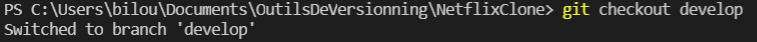

Une fois sur la branche `develop`, on met à jour notre code localement avec un `git pull origin develop` dans le but d'éviter les conflits. 
Une fois mise à jour, on réalise le merge de notre branche `release` vers la branche `develop` avec la commande :

`git merge origin 'nom_branche_release'`

Si aucun conflit est détecté, on envoie les modifications sur la branche avec un `git push origin develop`

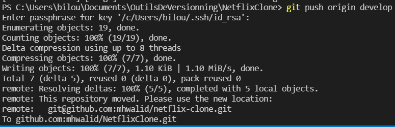

### Résolution de potentiels conflits 

Un conflit survient lorsque deux branches ont modifié la même ligne dans un fichier, ou lorsqu'un fichier a été supprimé dans une branche, mais modifié dans l'autre.

Si un conflit est détecté lors du`git merge origin 'nom_branche_release'` 

**Le conflit nous donne des informations sur le fichier ou le conflit a était détecté :**  

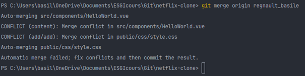

Une fois dans le fichier on vois une synthaxe de type <<<<HEAD code venant de la branche actuel  ==== code venant de la branche en cours de merge >>>>> nom_de_la_branche_merge : 

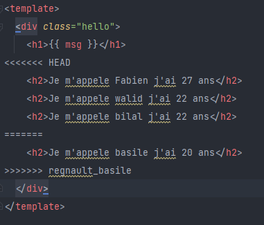

Cette syntaxe nous permet de savoir qu'elle est la différence détecter entre les deux branches. Ainsi le développeur peut choisir la version qu'il veut conserver.

## Mise à jour de la branche release  

Avant de mettre à jour la branche `release`, nous nous situons sur la branche `develop`. Avant de switcher sur notre branche `release`, nous allons vérifier que notre branche `develop` est bien mise à jour avec la commande `git pull origin develop` avant  de se positionner sur la branche avec un `git checkout release`.

**Une fois sur la branche, on met à jour localement le contenu de la branche avec la commande :** 

```shell
git pull origin release
```

 **On réalise ensuite le merge  de la branche `release` vers la branche `develop` avec :**

```shell
git merge origin develop
```

La commande `git merge` prendra deux pointeurs de commit, le dernier de la branche sur laquelle nous sommes positionnés et le dernier commit commun aux deux branches en question.	

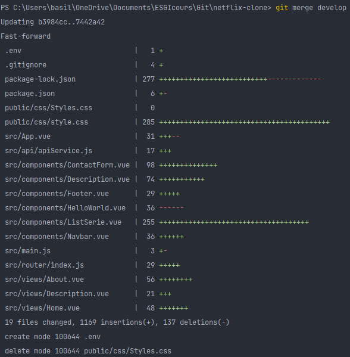

On peut ainsi voir le récapitulatif des fichiers qui ont subi des modifications (ajout et/ou suppression).

**Une fois le merge effectué sans détection de conflits, on exécute la commande pour envoyer les modifications sur la branche `release`:**

```shell
git pull origin develop 
```


## Mise à jour de la branche main

Lorsque la branche `release` a été testée et est opérationnelle, on la merge sur la branche main. Pour cela, on suit la même procédure que vu précédemment. Néanmoins, il faudra créer un tag de version.

### Création d'un tag de version

Les **tags** permettent de marquer des versions de code fonctionnel. Ils sont des références qui pointent vers des points spécifiques de l'historique de notre projet.

**La procédure pour créer un tag est la suivante :**

- Sur la page d'accueil de notre repository, on clique sur "Release" dans le menu de droite : 

  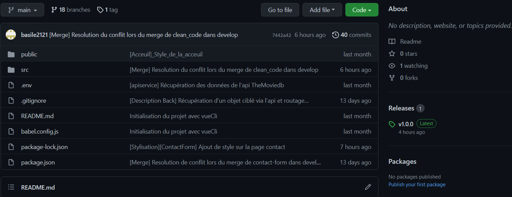

  

- On crée un nouveau tag en cliquant sur "Draft a new release" : 

  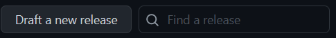

  

- On définit ensuite un nom de tag, soit on en ajoute un soit on en crée un nouveau : 

  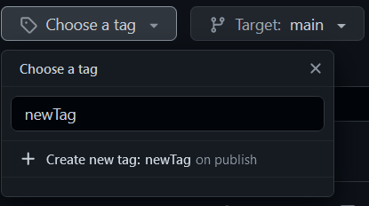
