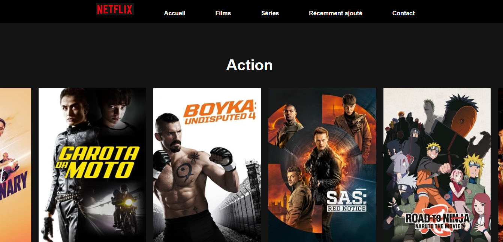

# Netflix clone project 
- [Présentation](#présentation)
- [API](#api)
- [Affichage des données](#affichage-des-données)
- [Description d'une série](#description-d'une-série)
- [Page de contact](#5page-de-contact)
- [Récupération du projet](#récupération-du-projet)
  - [Installer VueCli](#installer-vuecli)
  - [Installation des dépendances](#installation-des-dépendances))
  - [Lancer le serveur](#lancer-le-serveur)
  - [Compilation pour la mise en production](#compilation-pour-la-mise-en-production)
- [Annexe](#annexe)
  - [Page accueil site](#page-accueil-site)

## Présentation 

​	Le projet est un clone de la célèbre application de streaming Netflix. Le but du projet est de donner des informations sur les films et séries. Pour cela on utilise les technologies suivantes : 

- VueJs v3.0 (Un Framework JavaScript open-source qui permet de créer des sites dynamique en javascript)
- Vue cli v4.5.0 (Un utilitaire qui fournit une grande gamme d'outils et de pré-configurations pour un projet VueJs)

<u>Dépendances :</u> 

- Axios v0.25.0
- notify v3.10.0
- vue router v4.0

Pour récupérer les données des films et séries, on utilise l'API "**themoviedb**" qui est open source. (lien vers [API](https://www.themoviedb.org/))

## API

​	Pour récupérer les données de l'API on utilise le service `apiService.js`. Celui-ci nous permet de faire la liaison entre l'API et notre application. Ce service contient 2 constantes: 

- `getTwentyPopularMovies(page)` qui récupère 20 films parmis les plus populaires, pour toutes les catégories
- `getSingleMovie(id)` qui cible un film ou série via son id

## Affichage des données 

​	L'affichage des films et séries se fait grâce au composant « `ListSerie.vue` » . 

​	La méthode **`getAllMovies()`** réaliser "n" itérations sur la constante **`getTwentyPopularMovies()`** du service apiService.js et ajoute la liste des film au tableau allMovies[]. 

​	Afin de trier les film et séries par catégorie on crée le tableau orderMovies[] où chaque clé du tableau sera le nom d'une catégorie venant du tableau allGenres[] dans la méthode **`fillOrderMoviesIndex()`** et aura comme valeur l'ensemble des films ou série appartenant à cette catégorie.

​	Pour remplir le tableau orderMovies[] par les film/séries en fonction de leurs catégories, on exécute la méthode **`orderMoviesByGenre()`** qui parcourt la liste des film/séries contenus dans allMovies[], puis pour chaque film/série on parcourt la liste des genres dans allGenres[], pour ensuite parcourir la liste des clés du tableau allGenres[] qui sont les noms des catégories. Dès que la catégorie du film correspond au nom du genre on ajoute ce film dans le tableau à l'index correspondant de orderMovies[]. 

​	A noter qu'on exécute la méthode **`orderMoviesByGenre()`** dans la dernière itération de la boucle de **`getAllMovie()`** pour éviter les problèmes d'asynchronicité sinon le tableau allMovies[] n'a pas le temps de se remplir.

​	Enfin on appelle la fonction **`getAllMovies()`** dans la méthode `mounted` qui s'exécute dès la création du composant.

## Description d'une série 

​	Lors du click sur l'un des film ou série le composant « Description.vue » est appelé. Il récupère les détails d'un film ou série grâce à la méthode **`getSingleMovie()`** d'apiService lors du mounte du composant.

## Page de contact

​	Le formulaire de contact se trouve dans le composant « `ContactForm.vue` », il permet de saisir les différentes informations dont on a besoin pour contacter le site. L'envoie du formulaire se fait grâce à la méthode `checkForm()`

​	Nous aurons besoin de récupérer les champs saisis par l’utilisateur et les stocker dans un objet (« NewObj ») grâce à « v-model ». Une fois que l’on a toutes les informations nous pouvons les envoyer.

​	Nous notifions l’envoie de message avec la dépendance « Notify » qui affiche à l’écran un message de sucess :

```js
notyf.success('Merci '+ newObj.name + ' ' +newObj.firstName + ' pour votre message !');
```

​	Pour terminer, nous réinitialisons les champs saisie après soumission du formulaire. 

## Récupération du projet

### Installer VueCli
```shell
npm install -g @vue/cli
```

### Installation des dépendances
```shell
npm install
```

### Lancer le serveur

```shell
npm run serve
```

### Compilation pour la mise en production

```shell
npm run build
```

## Annexe 

### Page accueil site 


